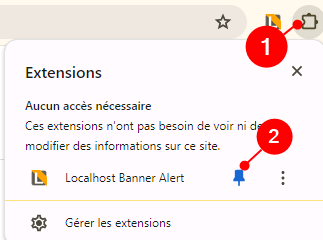
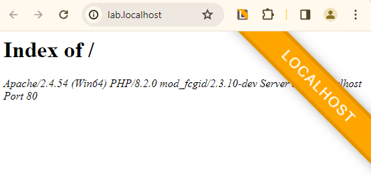
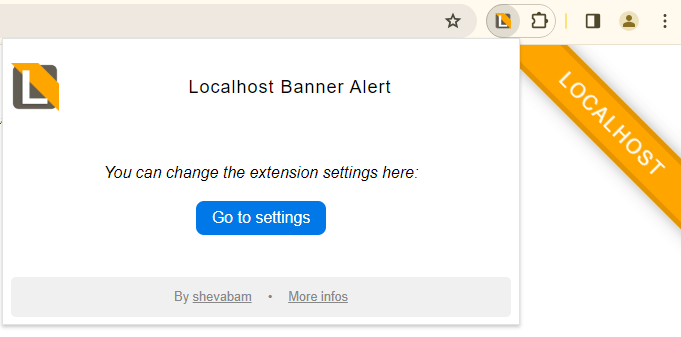
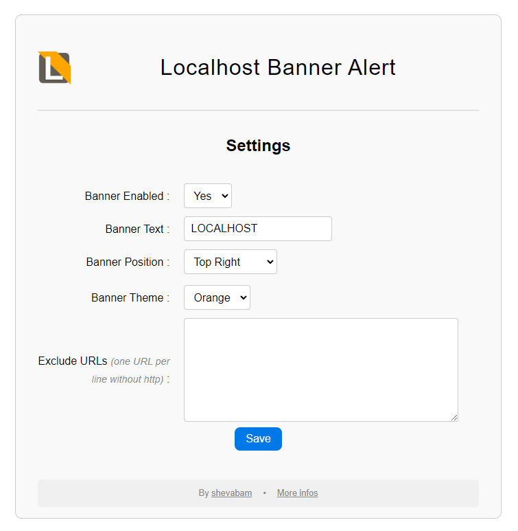

# Browser extension "Localhost Banner Alert"

**Localhost Banner Alert** is your companion for local development! This Chrome extension adds a visible banner to your browser to remind you when you're browsing localhost sites.

# Install

Install this extension from [**Chrome Web Store**]() or [**Microsoft Edge Store**]().

# Usage

After installing the extension, display it in your browser:

The banner is displayed on the right side of the visited site, as soon as one of the following terms is detected in URL:

* localhost
* .local
* 127.0.0.
* .test

# Settings

You can manage several parameters within the extension. Simply click on the extension button and then on "Go to settings":

* Banner enabled: Yes / No
* Banner Text : the text on the banner *(default: Localhost)*
* Banner Position : Top Left / Top Right *(default)* / Bottom Left / Bottom Right
* Banner Theme : Orange *(default)* / Red / Yellow / Blue / Purple / Green
* Exclude URLs : fill in the URLs that should not have the banner. One URL per line without http(s).

# Feedback

If you have a problem using this extension, or would like to request an enhancement, feel free to create an issue or say hello on [Twitter/X](https://twitter.com/shevabam)!

# Privacy Policy

The extension does not collect any user information or other information. Only extension-related parameters are stored.

